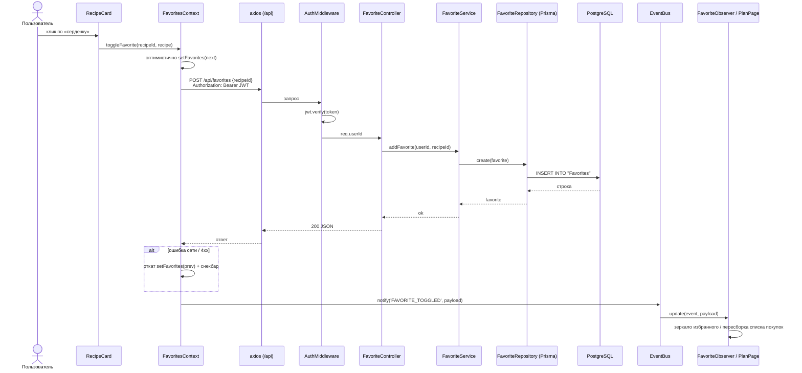

# Лабораторная работа №3 — Финализация прототипа и защита (актуализированная версия)

> Проект: **CookBook** — SPA «кулинарная книга» (React + TypeScript + MUI) с полноценным
> REST-бэкендом (Node.js + Express + Prisma + PostgreSQL).
> Ниже — отчёт, выверенный по реальному коду в репозитории. Все пути файлов — от корня проекта.

---

## 0. Что было не так в черновике и что исправлено

| № | В черновике | В проекте на самом деле (исправлено здесь) |
| - | ----------- | ------------------------------------------ |
| 1 | Сниппеты паттернов — старая версия кода (`mockRecipes`, `any`, localStorage-наблюдатель) | Приведены фрагменты **текущего** кода: типизированные `RecipeDraft`/`RecipeCreator`, `EventBus` с дженериками и типизированными payload, интеграция через `FavoritesContext`/`useRecipes` |
| 2 | Тесты лежат в `src/__tests__/*` и мутируют `mockRecipes` напрямую | Реальные файлы: `frontend/src/test/patterns.test.ts` (10), `frontend/src/test/app.test.tsx` (20), интеграционные — `backend/src/tests/api.test.ts` (10, supertest + настоящая БД `cookbook_test`) |
| 3 | «Не удалось: реальное API, загрузка изображений» | **Реализовано**: полный бэкенд (авторизация JWT, рецепты, избранное, план, загрузка фото `POST /api/upload`) |
| 4 | Диаграмма последовательности отсутствовала (пустой шаг) | Добавлена Mermaid-диаграмма «Добавление в избранное» + бонусная «Поиск со Strategy» |
| 5 | Архитектурная схема без слоёв Middleware/Repository | Схема приведена к реальному коду: Controllers → Services → Middleware → Repository (Prisma) → PostgreSQL |
| 6 | Прокси в `vite.config.ts` на порт 5000 | Реально — `http://localhost:8000` |
| 7 | Цифры тестов «8 модульных + 2 интеграционных» | Факт: **30 модульных + 10 интеграционных** (требование для одиночной работы: ≥8 и ≥2) |
| 8 | Слайд «Взаимодействие с агентом» — абстрактные промпты | Приведены реальные промпты, найденные ошибки агента и способы валидации |

---

## 1. Финализация прототипа

Что доведено до стабильного состояния (всё подтверждено тестами и e2e в Chromium):

- **Реальный бэкенд**: авторизация (JWT 7 дней), CRUD рецептов, рейтинг, комментарии, избранное, план питания, загрузка фото. Слои по архитектуре из ЛР2: `controllers → services → middleware → repositories (Prisma) → PostgreSQL`.
- **Обработка ошибок**: `ErrorBoundary` вместо белого экрана; страница 404; axios-интерцептор (401 → разлогин и редирект без зацикливания); `ImageWithFallback` для битых картинок; оптимистичные обновления избранного с откатом при ошибке сервера; безопасный `JSON.parse` для localStorage.
- **Стабильность навигации**: исправлен баг «затемнённый экран после перехода» (`Suspense` перенесён внутрь Layout вокруг `Outlet`); регресс проверяется `frontend/e2e/drawer.e2e.mjs` в реальном Chromium.
- **Кроссплатформенность**: исправлен Windows-баг путей загрузки (`fileURLToPath` вместо `.pathname` — иначе `C:\C:\...`).

## 2. Ключевые модули и «архитектура в коде»

Frontend (слои видны в структуре каталогов и направлениях импортов):

```
Pages (HomePage, RecipesPage, RecipePage, PlanPage, FavoritesPage…)
  → Hooks (useRecipes, useFavorites, useAuth, useDebounce)
  → Contexts (FavoritesContext, AuthContext — общее состояние, Observer-шина)
  → Services (recipeService, authService — единая точка входа в данные;
              SearchStrategies, RecipeFactory, EventBus — паттерны)
  → api (axios: baseURL /api, interceptor с JWT)
```

Backend:

```
controllers/ (auth, recipe, user, plan, upload)
  → services/ (бизнес-логика: правила рейтинга, валидация)
  → middleware/ (auth: jwt.verify; upload: multer; error: единый формат ошибок)
  → repositories/ (recipeRepository, favoriteRepository, planRepository…)
  → Prisma ORM → PostgreSQL
```

Ключевые модули, закрывающие must-have бизнес-логики:

| Модуль | Файл | Что делает |
| ------ | ---- | ---------- |
| Каталог и поиск | `frontend/src/hooks/useRecipes.ts` + `services/SearchStrategies.ts` | стратегии поиска (название/ингредиенты/категория), debounce, пагинация; в реальном режиме — серверная фильтрация |
| Избранное | `frontend/src/contexts/FavoritesContext.tsx` | одно состояние на приложение, оптимистичные обновления, откат, события для Observer |
| Создание рецепта | `frontend/src/services/RecipeFactory.ts` + `recipeService.ts` | фабрики категорий задают осмысленные дефолты |
| План питания и список покупок | `frontend/src/pages/PlanPage.tsx` | план на неделю, автозаполнение списка покупок из ингредиентов (Observer) |
| Авторизация | `backend/src/services/authService.ts`, `middleware/auth.ts` | bcrypt, JWT, защищённые маршруты |
| Данные | `backend/src/repositories/*` + `prisma/schema.prisma` | 8 таблиц, связи рецепт-ингредиент |

## 3. Паттерны GoF в коде (3 примера)

### 3.1 Factory Method — `frontend/src/services/RecipeFactory.ts`

```ts
export interface RecipeCreator {
  create(data: RecipeDraft): Recipe;
}

function buildRecipe(data: RecipeDraft, fallbackCategory: string, defaultCookingTime: number): Recipe {
  const category = data.category || fallbackCategory;
  return {
    title: data.title,
    description: data.description,
    category,
    cookingTime: data.cookingTime ?? defaultCookingTime,   // супы ~45 мин, завтраки ~15 мин
    servings: data.servings,
    imageUrl: data.imageUrl || '/placeholder-food.svg',
    ...
  };
}
// SoupRecipeFactory / DessertRecipeFactory / … + RecipeFactorySelector.getFactory(category)
```

Использование — `recipeService.createRecipe`:
`const factory = RecipeFactorySelector.getFactory(data.category); const recipe = factory.create(data);`

**Что даёт:** правила «дефолтов по категории» (время готовки, плейсхолдер фото) живут в одном месте на каждую категорию; добавление новой категории = новая фабрика без правки `recipeService` (Open/Closed). Селектор скрывает выбор реализации от клиента.

### 3.2 Observer — `frontend/src/services/EventBus.ts` + `FavoriteObserver.ts`

```ts
export interface Observer<T extends EventPayload = EventPayload> {
  update(event: AppEvent, data: T): void;
}

class EventBus {
  private static instance: EventBus | null = null;
  private observers: Map<AppEvent, Observer[]> = new Map();
  subscribe<T extends EventPayload>(event: AppEvent, observer: Observer<T>): void { … }
  unsubscribe<T extends EventPayload>(event: AppEvent, observer: Observer<T>): void { … }
  notify<T extends EventPayload>(event: AppEvent, data: T): void {
    const list = this.observers.get(event);
    if (!list) return;
    [...list].forEach((observer) => observer.update(event, data)); // копия: безопасная отписка во время notify
  }
}
```

Издатель — `FavoritesContext.toggleFavorite` после успешного изменения шлёт `eventBus.notify('FAVORITE_TOGGLED', …)`; `PlanPage` публикует `PLAN_UPDATED`; наблюдатель `FavoriteObserver` зеркалирует избранное, а подписчик в PlanPage пересобирает список покупок из ингредиентов плана.

**Что даёт:** слабая связанность — контекст избранного не знает о списке покупок и будущих подписчиках; новые реакции добавляются подпиской без правки издателя. Типизированные payload исключают «магические» строки в данных события.

### 3.3 Strategy — `frontend/src/services/SearchStrategies.ts`

```ts
export interface SearchStrategy { search(recipes: Recipe[], query: string): Recipe[]; }
export class TitleSearchStrategy implements SearchStrategy { … }
export class IngredientSearchStrategy implements SearchStrategy { … }
export class CategorySearchStrategy implements SearchStrategy { … }
export class CombinedSearchStrategy implements SearchStrategy { … } // композиция стратегий
export class SearchContext { setStrategy(…); executeSearch(…); }
```

Использование — `useRecipes.fetchRecipes` (mock-режим):

```ts
const strategies: SearchStrategy[] = [];
if (filters.search) strategies.push(new TitleSearchStrategy());
if (filters.category && filters.category !== 'Все') strategies.push(new CategorySearchStrategy(filters.category));
if (filters.ingredients?.length) strategies.push(new IngredientSearchStrategy(filters.ingredients));
searchContext.setStrategy(strategies.length === 1 ? strategies[0] : new CombinedSearchStrategy(strategies));
filtered = searchContext.executeSearch(filtered, filters.search ?? '');
```

**Что даёт:** алгоритмы фильтрации изолированы и тестируются поодиночке (см. тесты ниже); комбинации фильтров собираются в рантайме без цепочек `if/else` в хуке; в реальном режиме тот же набор фильтров сериализуется в query-параметры сервера — стратегии остаются источником правды о том, «что фильтруем».

## 4. UML-диаграмма последовательности

Сценарий: **«Добавление рецепта в избранное» (реальный режим)**.
Код для Mermaid Live Editor (mermaid.live) или вставки в отчёт:



Бонусная (если нужна вторая): **«Поиск рецептов со Strategy»** — `RecipesPage → useRecipes → SearchContext → (Title|Category|Ingredient|Combined)SearchStrategy → recipeStore/api → возврат страницы результатов`.

## 5. Тестирование

Запуск: `frontend: npm test` (или `npx vitest run --coverage`), `backend: npm test`.

| Файл | Тип | Кол-во | Что проверяет |
| ---- | --- | ------ | ------------- |
| `frontend/src/test/patterns.test.ts` | модульные | 10 | Factory Method (дефолты, селектор), Strategy (каждая стратегия + композиция + подмена в контексте), Observer (доставка, отписка, отсутствие дублей, зеркало избранного) |
| `frontend/src/test/app.test.tsx` | модульные | 20 | authService (mock), recipeStore (персист), recipeService, useRecipes, useDebounce, синхронизация избранного через контекст, рендер страниц (каталог, фильтр «Супы», заголовок вкладки, фильтр из URL, дашборд главной), PlanPage (автокомплит любого блюда, запрет дублей, Observer-синхронизация списка покупок) |
| `backend/src/tests/api.test.ts` | **интеграционные** | 10 | supertest + настоящая БД `cookbook_test`: register/login/профиль, 401 без токена, создание рецепта с ингредиентами, поиск по трём фильтрам, пагинация, комментарии+оценка, избранное add/list/remove, план put/get |

**Итого: 30 модульных + 10 интеграционных** (требование: ≥8 и ≥2). Все проходят: `30 passed`, `10 passed`.

Покрытие ключевых модулей (frontend, `vitest --coverage`, provider v8):

| Модуль | Statements |
| ------ | ---------- |
| `services/SearchStrategies.ts` | 100 % |
| `services/EventBus.ts` | 97.2 % |
| `services/RecipeFactory.ts` | 92.9 % |
| `hooks/` (useRecipes, useDebounce, useFavorites…) | 90.9 % |
| `services/FavoriteObserver.ts` | 85.7 % |

Edge cases в тестах: неизвестная категория → дефолтная фабрика; отписка во время `notify` не роняет шину; дубль блюда в том же приёме пищи отклоняется; 401 без токена и дубликат email на бэкенде; пустой результат поиска рендерит «Рецептов не найдено».

### Роль агента в тестировании

Тесты писались агентом итеративно: первый прогон выявил 4 падения — неверная assumption об авторизации в тестовом хелпере (register вызывался дважды → 409), неучтённый порядок ингредиентов из Prisma (assert сделан нечувствительным к порядку), падение автокомплита на главной из-за серверной пагинации (в PlanPage добавлен отдельный полный список `allRecipes`). Каждое падение чинилось в продукте или тесте и прогонялось заново до зелёного.

## 6. Код-ревью и рефакторинг (что изменено и почему)

| Изменение | Почему |
| --------- | ------ |
| Убраны все `any`: введены `RecipeDraft`, `RecipeFormValues`, `NewRecipeInput`, типизированные payload событий | строгий `tsc` ловит ошибки на compile-time; интерфейс паттернов стал контрактом |
| Избранное вынесено из локальных `useState` в `FavoritesContext` | единое состояние: сердце на карточке и страница «Избранное» больше не рассинхронизируются |
| Мок-данные изолированы в `recipeStore` с версионированием ключа localStorage | данные переживают перезагрузку; `reset()` для тестов; чистая точка замены на реальный API |
| Флаг `USE_MOCK` переехал из хардкода в `VITE_USE_MOCK` (`useMock.ts`); найдена и исправлена оставшаяся захардкоженной копия в `authService` | один источник правды для режима данных; без фикса реальная авторизация не включалась |
| `Suspense` перенесён внутрь `Layout` вокруг `Outlet`, `onClose` Drawer без toggle | устранён «зависающий» backdrop при навигации (e2e-регресс `drawer.e2e.mjs`) |
| Поиск через `useDebounce` (300 мс) + скелетоны | не дёргаем фильтрацию/сервер на каждое нажатие; нет мигания спиннером |
| Ленивые роуты (`React.lazy`) | главный бандл 551 КБ → ~410 КБ, страницы — отдельными чанками |
| Windows-фикс `uploadDir`: `fileURLToPath` вместо `.pathname` | `.pathname` давал `/C:/...` → `mkdir C:\C:\...` падал с ENOENT на Windows |
| Ленивый полный список `allRecipes` в PlanPage + `addToPlan(recipe, day)` | после серверной пагинации хук отдаёт только страницу; автокомплит и снекбары работали с устаревшим списком |

## 7. Видео-демонстрация (сценарий, 3 минуты)

| Время | Действие | Требование |
| ----- | -------- | ---------- |
| 0:00–0:20 | Вход `demo@cookbook.com/demo123` (реальный бэкенд), дашборд главной: приветствие, статистика, «План на сегодня» | авторизация, главная |
| 0:20–0:50 | Каталог `/recipes`: поиск «суп» (debounce+скелетоны), чип категории, пагинация | список, поиск, фильтры |
| 0:50–1:10 | Поиск по ингредиентам «курица, рис» | поиск по ингредиентам |
| 1:10–1:35 | Страница рецепта: ингредиенты, шаги, оценка 1–5, комментарий | полный рецепт, рейтинг, комментарии |
| 1:35–1:55 | «Сердечко» → страница «Избранное» (синхронно), убрать из избранного | избранное |
| 1:55–2:20 | Создание рецепта: форма + загрузка фото (multer), рецепт появляется в каталоге | создание рецепта |
| 2:20–2:50 | План питания: добавить блюдо автокомплитом, ✨ автозаполнение списка покупок, чекбокс автообновления | план, список покупок |
| 2:50–3:00 | Тёмная тема, итог | UI |

Запись: OBS/Win+G, 1080p; показывать DevTools Network в момент «сердечка» (видно POST /api/favorites) — сильный аргумент про «реальный бэкенд».

## 8. Презентация (слайды, до 3 минут)

**Слайд 1 — Проблема и решение.** Боль: рецепт сложно подобрать под имеющиеся продукты; планирование недели и список покупок ведутся в голове/заметках. Аудитория: домашние кулинары. Решение: поиск по ингредиентам, план на неделю с автосписком покупок, избранное, рейтинги.

**Слайд 2 — Структурная схема.**

```
┌─────────────── Frontend (React 18 + TS + MUI, Vite) ───────────────┐
│ Pages → Hooks → Contexts (Auth/Favorites/Theme) → Services          │
│   services: RecipeFactory | EventBus+Observers | SearchStrategies   │
│   api (axios, JWT-interceptor) ── /api (vite-proxy в dev)           │
└───────────────────────────────┬────────────────────────────────────┘
                                │ REST / JSON
┌─────────────── Backend (Node.js + Express) ────────────────────────┐
│ Controllers → Services → Middleware (auth/upload/error/CORS)        │
│      → Repositories → Prisma ORM                                    │
└───────────────────────────────┬────────────────────────────────────┘
                                ▼
                    PostgreSQL (8 таблиц)
```

**Слайд 3 — Обоснование архитектуры (ADR-кратко).** REST+JSON: простой контракт, независимая разработка и тестирование слоёв; слоистость бэкенда — тесты идут через HTTP (supertest), репозитории скрывают Prisma. Рассмотренные альтернативы и почему отклонены: GraphQL (оверкилл для фиксированного набора сущностей, сложность кэширования); Redux — контекстов достаточно при одном источнике данных на домен, меньше шаблонного кода; сессии вместо JWT — усложняют горизонтальное масштабирование; TypeORM/raw SQL — Prisma даёт типобезопасный query-builder и миграции из схемы.

**Слайд 4 — Паттерны (фрагменты кода из §3 + «что даёт»).** Показывать 2–3 коротких фрагмента: `RecipeFactorySelector.getFactory`, `eventBus.notify` в FavoritesContext, сборка `strategies[]` в useRecipes.

**Слайд 5 — Взаимодействие с ИИ-агентом.**
- Делегировано: сборка проекта из исходников, реальный бэкенд по диаграмме, паттерны GoF, тесты (30+10), e2e, редизайн, README.
- Примеры промптов: «давай настоящий бэк подключим — что нужно» (+ диаграмма архитектуры); «экран затемняется при навигации — исправь»; «3 паттерна GoF с путями файлов и таблицей применения»; «сделай дизайн аккуратнее»; «напиши в README чёткую инструкцию запуска».
- Что пришлось корректировать: агент оставил `USE_MOCK = true` хардкодом в `authService` (реальная авторизация не включалась — поймали e2e по mock-токену); тест агента падал из-за порядка ингредиентов из Prisma; черновик лабы ссылался на устаревшие сниппеты — сверяли с кодом.
- Валидация результатов: `tsc`/`eslint`, прогон юнитов и интеграционных, e2e в Chromium, скриншоты, curl-проверки API.

**Слайд 6 — Тестирование и качество.** 30 модульных + 10 интеграционных; покрытие ключевых сервисов 85–100 %; e2e-регресс drawer; найденные агентом и исправленные баги: зависающий backdrop, рассинхрон избранного, Windows-путь загрузок.

**Слайд 7 — Выводы и ограничения.** Получилось: полноценное fullstack-приложение, паттерны в коде, CI. Ограничения: список покупок хранится в localStorage (не синхронизируется между устройствами); рейтинг усредняется (не история оценок); нет восстановления пароля и i18n. Перспективы: вынос списка покупок на сервер, Docker-образ, мобильная версия.

---

*Команды для проверки перед защитой:*
`frontend: npx tsc --noEmit -p tsconfig.app.json && npx eslint src && npm test && npx vitest run --coverage`
`backend: npm run typecheck && npm test`
`e2e: node frontend/e2e/drawer.e2e.mjs` (нужны запущенные backend и frontend).
